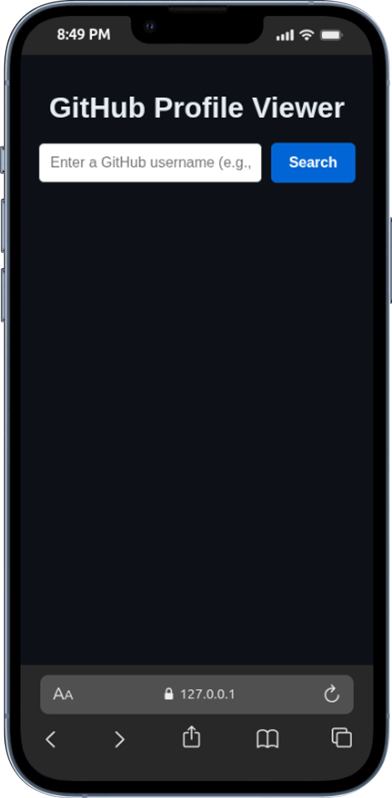
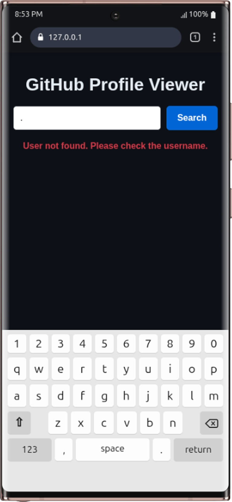

# GitHub Profile Viewer

A simple web app that lets you search for any GitHub user and display their profile card with avatar, bio, and stats. Built with HTML5, CSS3, and JavaScript

## 🎯 Project Goals

This project aims to:

- Practice working with external APIs using the Fetch API
- Build a clean, responsive user interface without any framework
- Handle errors gracefully with user feedback
- Manage multiple UI states (loading, error, success)
- Learn async/await with real-world API calls

## 🌟 Features Included

- **Search by login**: Enter a GitHub login (e.g., mike2377) to fetch their profile. The search uses the login handle, not the display name.
- **Profile card**: Avatar, name, username, and bio displayed
- **Stats display**: Public repos, followers, and following
- **Direct link**: Click the card to open the user's GitHub profile in a new tab
- **Loading indicator**: Shows "Loading profile..." while fetching data
- **Error handling**: Friendly message if the user is not found

## 🛠 Tech Stack

### Languages

- HTML5
- CSS3
- JavaScript (ES6)

### Other Tools

- Git & GitHub
- VS Code
- GitHub REST API

## 📷 Page Preview

### Default View (empty search)



### Profile Card Displayed

.png)

### Error State (user not found)



## 📂 Project Structure

```text
github-profile-viewer/
├── assets
│   └── images
│       ├── Galaxy-Note20-Ultra-127.0.0.1 (2).png
│       ├── Galaxy-Note20-Ultra-127.0.0.1.png
│       └── iPhone-13-PRO-127.0.0.1.png
├── index.html
├── README.md
├── script.js
└── style.css
```

## 🚀 Getting Started

Clone the repository:

```bash
git clone https://github.com/mike2377/github_profile.git
cd github-profile
```

Open the project in your browser:

```bash
Simply open index.html in any browser
open index.html
```

## 🧠 Challenges Faced

- **First time with async/await**: This was my first project using the Fetch API. I had to learn to check `response.ok` before parsing JSON and throw errors inside `try/catch`. Initially I just checked `response.json()` without verifying success, which caused silent failures.

- **Managing multiple UI states**: The app has three visible states — loading, error, and profile card. I had to make sure they never overlap. Each function clears the previous state before showing the new one.

- **Handling null values from API**: The search uses `user.login` in the API URL, but the display name (`user.name`) can be `null` if the user never set one. I used `user.name || user.login` as a fallback so the card always shows a name.

- **Building HTML with template literals**: Used template literals instead of `createElement` for cleaner code. Had to be careful with `${user.login}` inside the `alt` attribute to avoid breaking the HTML.

## 📚 What I Learned

- Using `fetch()` with `async/await` to call a real REST API
- Checking `response.ok` before parsing JSON
- Throwing custom errors based on HTTP status codes
- Managing UI states (loading / error / success)
- Handling `null` values from APIs with fallbacks (e.g., `user.name` is often null, so I fall back to `user.login`)

## 🚀 Future Improvements

- Display the user's recent repositories (the API provides them)
- Add a language filter for repos
- Save search history in localStorage

## 👨🏽‍💻 Author

**Kembou Keumoe Ivan Michael**  
Junior Fullstack Developer  
📩 Email: [kman39457@email.com](mailto:kman39457@email.com)  
🌍 Based in Cameroon | Open to remote opportunities
